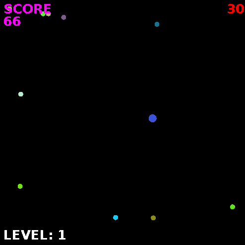

Dodge
=====

A simple 2D dodge game that implements gravitational attraction. Made in my senior year of high school.

### Files
* `Dodge.java` contains the main. This starts a `Framer`, which takes a `DoubleBufferedCanvas` that is passed to it and puts it in a window. `Dodge` is also an actualization of `DoubleBufferedCanvas`, it contains the necessary `draw` and `updateVars` methods.
    * `updateVars` contains most of the physics logic, done by operating on a `Ball`.
* `Framer.java` is used to create a window around a `DoubleBufferedCanvas`.
* `DoubleBufferedCanvas.java` is my personal implementation of a pseudo-double buffered canvas. It is an abstract interface that is a `Runnable`. The constructor must be supplied a desired fps target, and the `DoubleBufferedCanvas` will display a FPS tracker. The `DoubleBufferedCanvas` also tracks key presses. All actualizations must implement `draw` and `updateVars`.
* `Ball.java` is a pretty simple object class which keeps track of the position and physics `Vectors` of a ball.
* `Vector.java` is another simple object class to represent vectors that are used for physics operations.
